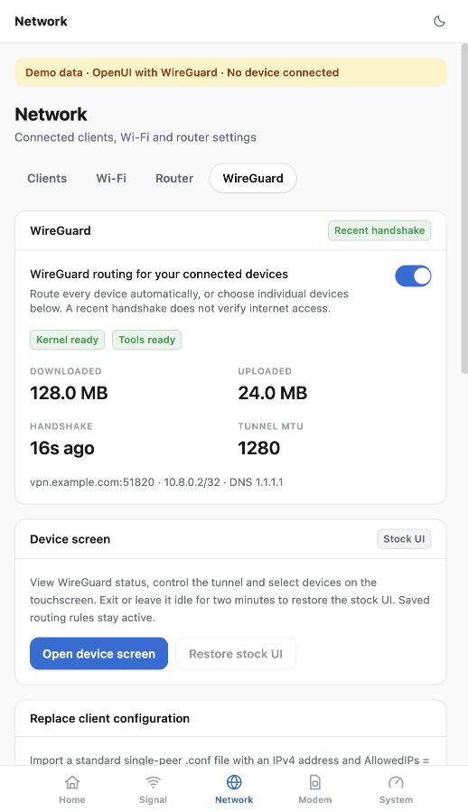
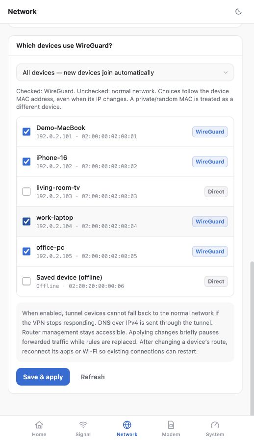
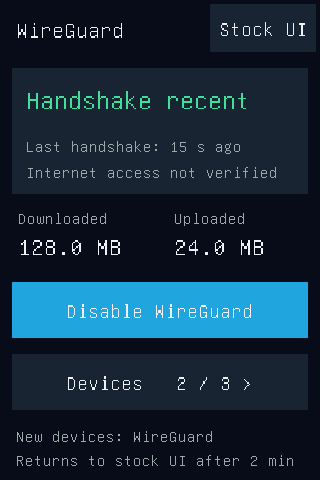
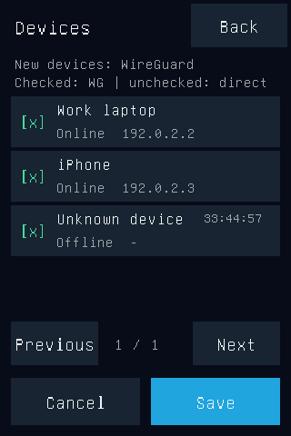

# MU5250-OpenUI-Wireguard

**OpenUI with WireGuard for the ZTE U60 Pro (MU5250).**

This project is a full fork of [MU5250-OpenUI](https://github.com/dklasens/MU5250-OpenUI)
with an integrated WireGuard gateway and an English touchscreen control panel.
It retains OpenUI's Home, Signal, Network, Modem and System pages, existing login,
Rust agent and deployment workflow. WireGuard lives in **Network → WireGuard**.

| Management service | Address |
| --- | --- |
| OpenUI dashboard | `http://192.168.0.1:8080/` |
| Authenticated OpenUI API | `http://192.168.0.1:9090/` |

## Device

| **Model** | ZTE U60 Pro (MU5250) |
| ------------ | ------------------------ |
| **Hardware** | `MU5250_HW1.0` |
| **Firmware** | `CN_ZTE_MU5250V1.0.0B31` |

| **Chipset** | Qualcomm Snapdragon X75 (SDX75 / SDXPINN) |
| ----------- | ----------------------------------------- |
| **CPU** | 4x Cortex-A55 (ARMv8.2-A) @ 2.2 GHz |

These are the target device details supplied by the project owner. They do not
establish compatibility with other models, hardware revisions or firmware.

## Screenshots

Actual browser captures of this fork, using **synthetic demo data**. The endpoint,
client names, MAC addresses and traffic values below are examples, not a live VPN
measurement or private device information.

| WireGuard status and screen controls | Device routing and offline selections |
| --- | --- |
|  |  |

The small-screen images below are generated by the native panel's own renderer
with sample data. They show the logical upright view; the physical framebuffer
and touch coordinates are rotated **180°** for the U60's display orientation.

| Touchscreen home | Touchscreen device selection |
| --- | --- |
|  |  |

## WireGuard features

- Import a standard single-peer WireGuard client `.conf` through OpenUI.
- Send all current and future LAN devices through WireGuard, with individual MAC
  exclusions; or enable the tunnel only for checked devices.
- Retain and edit saved offline device selections. Save changes as a batch.
- Show tunnel state, recent handshake, traffic counters, endpoint and MTU.
  A recent handshake does not establish that internet access works.
- Keep configuration private: the API never returns the saved private key or PSK.
- Open the device's English 320×480 touchscreen panel from the WireGuard page.
  View status, toggle the tunnel, and change device selections without handling keys.
- Restore the stock display and touch services on exit, two minutes of inactivity,
  or a panel failure detected by its supervisor. Exiting the panel preserves routing.
- Check configuration revisions so webpage and touchscreen edits cannot silently
  overwrite each other.

The rest of OpenUI is retained: modem signal and band/cell controls, Wi-Fi and
router settings, clients, APN, SMS, battery controls, logging and system information.
See [dashboard documentation](docs/DASHBOARD.md).

## Routing behavior

This version manages one **kernel WireGuard IPv4 tunnel**. It needs root access,
WireGuard support in the existing firmware, iproute2, iptables/ip6tables and `wg`.
The router's own traffic keeps its normal WAN route.

Checked devices use the tunnel. Unchecked devices keep normal network access.
Selected clients' IPv6 internet traffic and IPv6 DNS to the router are blocked
because this implementation does not tunnel IPv6. IPv4 DNS is sent through the
tunnel. Local management remains accessible. Changing a policy briefly pauses
forwarded LAN traffic while the rules are replaced; reconnect existing client
applications after changing their route.

When installed tunnel policy is active, a failed peer does not cause selected
traffic to fall back to WAN. Turning WireGuard off intentionally restores normal
routing. Boot and stock-firewall reload intervals are **not** guaranteed to retain
this blocking policy. See [WireGuard behavior and recovery](docs/WIREGUARD.md).

## Build from this repository

Requires Rust with the `aarch64-unknown-linux-musl` target, `cargo-zigbuild`,
Zig 0.14.1, Python 3, and Node.js `^20.19.0 || >=22.12.0` with npm.
Install/configure these development tools before running:

```sh
cargo zigbuild --locked --release -p zte-agent --target aarch64-unknown-linux-musl
cd web-app
npm ci
npm run build
cd ..
mkdir -p build
tar czf build/dashboard-dist.tar.gz -C web-app/dist .
python3 scripts/prepare-wireguard.py --output build/wireguard/wg
ZIG=/path/to/zig sh screen/build.sh
```

The `wg` preparer downloads a checksum-pinned official OpenWrt package and
extracts only the CLI. The screen build fetches checksum-pinned GNU Unifont.
Neither command contacts or changes your modem.

### Update an existing OpenUI installation

Use your existing root SSH access and this repository's locally built components.
This updates OpenUI itself; it does not start a separate management application.

```sh
python3 scripts/deploy-components.py \
  --gateway 192.168.0.1 \
  --ssh-key '/path/to/id_ed25519' \
  --agent target/aarch64-unknown-linux-musl/release/zte-agent \
  --dashboard build/dashboard-dist.tar.gz \
  --wireguard-tools build/wireguard/wg \
  --screen build/screen/openui-screen \
  --dry-run
```

Enter your **existing OpenUI agent password** when prompted. If you use a PIN,
provide the existing `ZTE_AGENT_PIN` environment value as well: this script renders
the startup credentials from these inputs, and an omitted PIN disables PIN login.
Do not put credentials in a committed file. Review the dry-run result, then repeat
without `--dry-run` to deploy through OpenUI's snapshot and rollback flow.
Restore the stock screen before replacing the screen binary.

After installation, run the supervised recovery verification before enabling the
webpage's screen entry:

```sh
python3 scripts/verify-screen.py --gateway 192.168.0.1 \
  --port 2222 --ssh-key '/path/to/id_ed25519'
```

This verification temporarily takes over the physical display and tests normal,
idle, crash and stalled-panel recovery. Details: [screen documentation](docs/SCREEN.md).

The inherited desktop installer and upstream release downloads are retained as
OpenUI tooling; they are **not release packages for this fork's WireGuard feature**.
An upstream installer/update can overwrite the additions. Use the source build
and component deployment above for this fork. For devices without working OpenUI
or SSH, consult [upstream setup and firmware compatibility](docs/DEPLOYMENT.md).

## Local demo and checks

Run these in two terminals:

```sh
python3 web-app/tools/mock_agent.py --port 19090 --wireguard-demo
```

```sh
cd web-app
npm ci
npm run demo
```

Open the Vite URL and sign in with any nonempty demo password. Both development
servers should remain on loopback. The mock holds data only in memory and does
not contact the device. Production builds use the normal device API on `9090`
and do not include the demo banner or demo API address.

```sh
cargo test --locked -p zte-agent -p process-runner
python3 -m unittest discover -s tests -v
python3 scripts/check-api-contract.py
cd web-app
npm run build
npm run lint
npm test
cd ..
sh screen/build.sh --preview
```

This repository preparation was checked locally, including browser screenshots,
Rust/Python/frontend tests and native rendering. It has not been deployed as a
new fork release in this task. Physical recovery and actual VPN egress must be
verified on the target device after deployment and configuration import.

## Acknowledgements

- [dklasens/MU5250-OpenUI](https://github.com/dklasens/MU5250-OpenUI) — the OpenUI
  backend, dashboard, installer and deployment foundation used by this fork.
- [jesther-ai/open-u60-pro](https://github.com/jesther-ai/open-u60-pro) — the original
  open U60 project and device access work on which OpenUI is based.
- [amenekowo/mu5250_tweaking](https://github.com/amenekowo/mu5250_tweaking) — MU5250
  hardware research and the Atomic DRM example used for the touchscreen component.

Thanks also to GNU Unifont and the WireGuard project. Original author and license
notices are preserved; no ZTE firmware, private configuration or original reference
archive is included in this repository.

## Copyright and licenses

Copyright © 2026 **ZweiChen and contributors** for this fork's additions.
Existing contributions retain their original authors' copyrights.

| Component | License |
| --- | --- |
| OpenUI agent, dashboard and general tooling | [MIT](LICENSE), preserving David Klasens and Jesther Silvestre notices |
| Separate native screen program and adapted DRM code | [GPL-3.0-or-later](screen/LICENSE) |
| Converted GNU Unifont bitmap | [SIL Open Font License 1.1](screen/FONT-LICENSE) |
| Dependencies and downloaded tools | Their respective upstream licenses |

See [NOTICE](NOTICE), [screen notices](screen/NOTICE) and [preserved upstream
licenses](licenses/). The root MIT license does not relicense GPL screen code or
third-party fonts. Distributing the GPL screen executable requires its corresponding
source and applicable notices; the screen source and build scripts are provided here.
